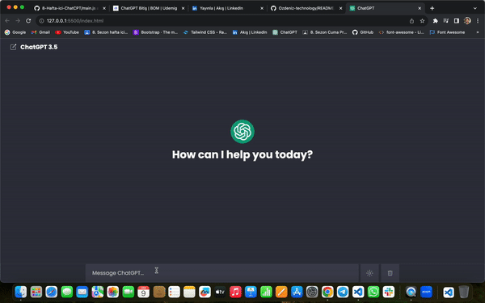

<h1>ChatGPT Clone Project</h1>

<h2> Proje Hakkında </h2>

Bu projeyi geliştirirken, HTML, CSS ve JavaScript teknolojilerini kullanarak modern ve kullanıcı dostu bir tasarım oluşturmayı hedefledim. Ayrıca, kullanıcıların tercihlerine göre açık veya koyu modda gezinebilme imkanı sunarak daha kişiselleştirilmiş bir deneyim sunmayı amaçladım.

Projenin içerdiği temel özelliklerden biri de silme butonu. Bu özellik sayesinde kullanıcılar, istemedikleri içerikleri kolayca silebilirler, böylece daha düzenli bir kullanım elde edebilirler.

<h2> Kullanılan Teknolojiler </h2>

HTML
CSS
JavaScript

<h2> Öne Çıkan Özellikler </h2>

Açık ve koyu mod seçenekleri
Silme butonu eklenerek daha kullanıcı dostu bir deneyim

<h2> Ekran Görüntüsü </h2>

